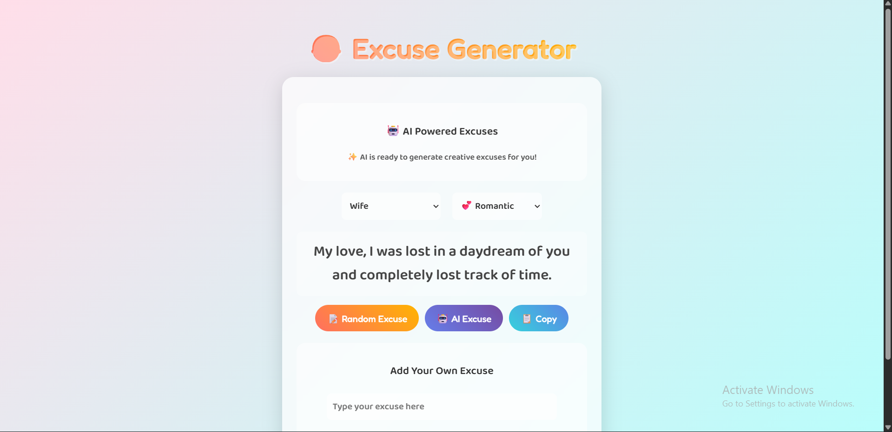

# [The Perfect Excuse] 🎯

## Basic Details
### Team Name: [SONDER tbd]

### Team Members
- Team Lead: Mohammed Sinan] - [EMEA Arts and science College]

### Project Description

The Excuse Generator is a fun web app that instantly gives you hilarious and believable excuses for any situation — from being late to escaping awkward moments. Just pick a category like work, school, or relationships, and get a witty way out in one click.
### The Problem (that doesn't exist)

### The Solution (that nobody asked for)
We built the Excuse Generator, a magical button that spits out absurd-yet-plausible excuses on demand. Need to avoid the gym? Boom — “My shoes ran away.” Late for work? Easy — “A squirrel stole my bus pass.” Problem solved, fun guaranteed.
## Technical Details
### Technologies/Components Used
For Software:
Languages used: HTML, CSS, JavaScript

Frameworks used: None (pure vanilla for lightweight fun)

Libraries used: Google Fonts for typography styling

Tools used: VS Code for development, GitHub for version control, Web Browser for testing

### Implementation
For Software:
# Installation
[HTML]

# Run
[HTML]

### Project Documentation
For Software:

### Project Demo
# Video
[final](Generator.mp4)
*Explain what the video demonstrates*

# Additional Demos
[Add any extra demo materials/links]

## Team Contributions
- [Mohammed sinan]: [Full]

---
Made with ❤️ at TinkerHub Useless Projects 

#
